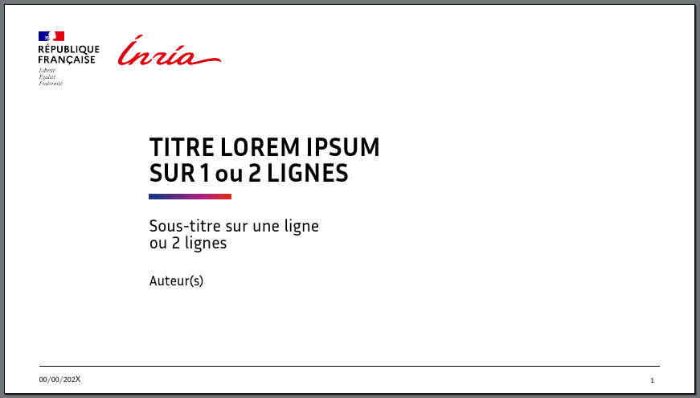

# Thème Inria pour LaTeX, supports de présentation Beamer

Ce style beamer correspond à la mise à jour des 
[gabarits](https://intranet.inria.fr/Vie-pratique/Informer-Communiquer/Identite-l-essentiel/Gabarits-mis-a-disposition)
proposés par Inria pour l'édition de présentations.




Pour utiliser le style rapidement, il suffit de copier les fichiers et modifier le
fichier `main.tex`.

Le thème intègre directement l'utilisation possible des fontes Inria si
celles-ci sont disponibles via le paquet
[inriafonts](https://gitlab.inria.fr/gabarits/latex-inria-fonts).
L'utilisation des fontes Inria nécessite une compilation avec
XeLaTeX/LuaLaTeX. 

Pour utiliser ces fontes, il suffit de rajouter le paquer à la racine
s'il n'est pas déjà installé.

``` shell
$ git clone https://gitlab.inria.fr/gabarits/latex-inria-fonts
```


